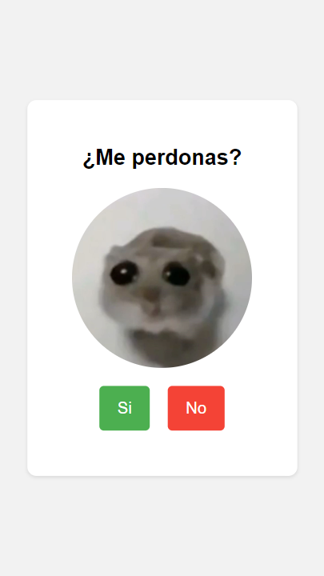

# Ratita Triste

**Ratita Triste** es una pequeña aplicación web interactiva que presenta una imagen de una ratita triste y permite al usuario interactuar con ella. El usuario puede hacer clic en dos botones para mostrar un mensaje de agradecimiento y luego reiniciar la aplicación.

## Características

- **Interacción Simple**: El usuario puede hacer clic en "Sí" o "No" para interactuar con la ratita triste.
- **Escalado del Botón**: Al hacer clic en el botón "No", el botón "Sí" se escala progresivamente.
- **Reproducción de Audio**: Un archivo de audio se reproduce en bucle mientras se interactúa con la aplicación.
- **Mensajes Dinámicos**: Se muestra un mensaje de agradecimiento cuando el usuario hace clic en "Sí".
- **Reinicio**: Se puede reiniciar la aplicación con un botón de reinicio.

## Tecnologías Utilizadas

- **HTML**: Estructura de la aplicación.
- **CSS**: Estilos para el diseño de la página.
- **JavaScript**: Lógica de interacción y manipulación del DOM.
- **Audio**: Reproducción de audio en bucle.

## Uso

1. **Interacción con la Ratita**:
    - Haz clic en el botón **"Sí"** para ver un mensaje de agradecimiento y un botón de reinicio.
    - Haz clic en el botón **"No"** para escalar el botón **"Sí"** y reproducir el audio en bucle.

2. **Reiniciar la Aplicación**:
    - Haz clic en el botón de reinicio para recargar la página y restablecer el estado de la aplicación.

## Captura de Pantalla

Aquí tienes una captura de pantalla de la aplicación:

## URL de la Web

Puedes acceder a la aplicación en línea en: [Ratita Triste](https://alfonsovidrio.github.io/ratita-triste/)

